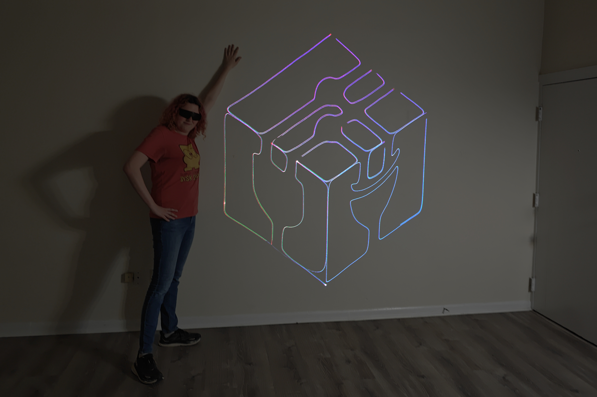

# Laser Vector Projector

Read the project writeup [here](https://breq.dev/projects/laser-projector)!

> This project is sponsored by PCBWay, who generously provided PCB fabrication services for this project. PCBWay provides high-quality boards with fast turnaround at low cost, and are a great option for both hobbyists and professionals.

Contained in this repository:

- [KiCAD Board Layout Files](board)
- [Bill of Materials](board/ESP32%20Galvo%20Driver.csv)
- [Firmware](galvo-firmware) -- you'll need to have the [Espressif toolchain](https://docs.espressif.com/projects/rust/book/getting-started/toolchain.html) installed to compile this
- [CAD files](cad) (SketchUp source files and STL)

Stuff not covered in the Bill of Materials:

- [RGB laser module and driver](https://www.aliexpress.us/item/3256810125144918.html)
- [Galvos with XY mount, driver, and power supply](https://www.aliexpress.us/item/3256809659931894.html)
- [Laser safety goggles](https://lasersafety.com/product/f42-p5l13-5000/)
